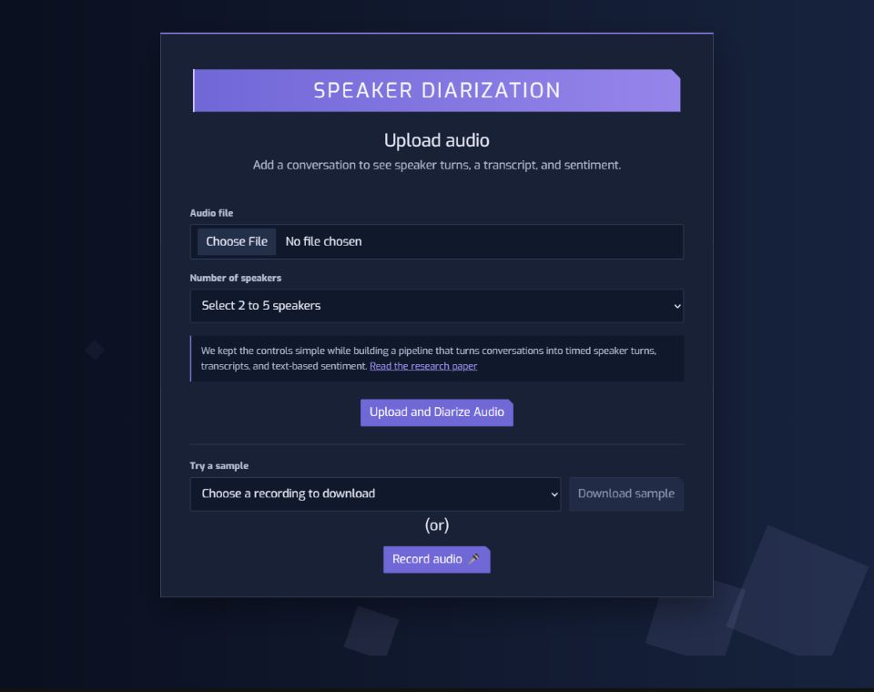
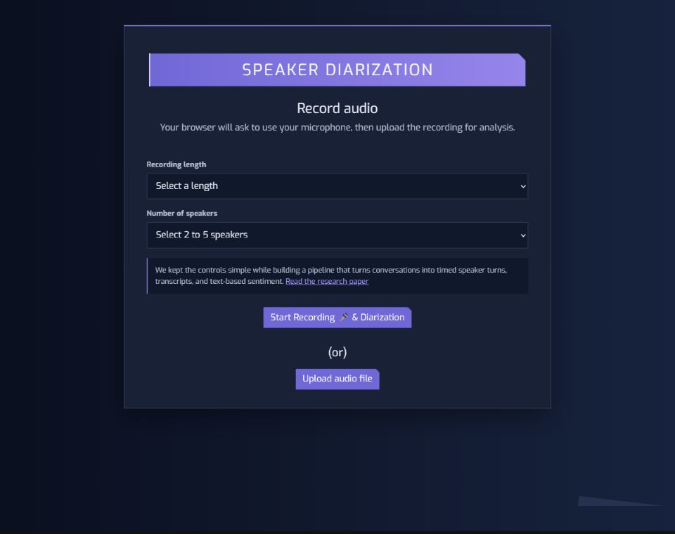
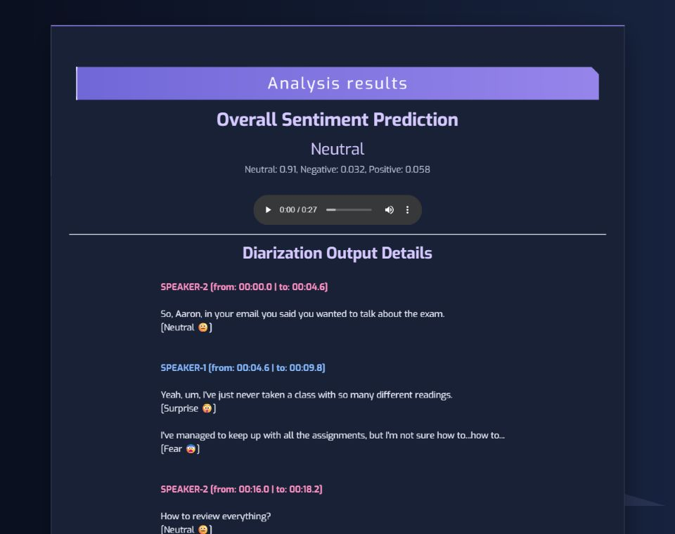

# Speaker Diarization System

This project turns a spoken conversation into a transcript grouped by estimated speaker, with sentiment labels for each speech segment, each speaker, and the conversation overall. It is a local research/demo application built around **English audio with 2–5 speakers**.

The work concentrates on joining several tasks in one usable flow: accepting an audio file or browser recording, transcribing speech, assigning speaker labels, and showing simple sentiment results in a Flask interface. Speaker labels are estimates (`SPEAKER-1`, `SPEAKER-2`, and so on), not names or verified identities. The sentiment labels are rules derived from VADER scores; they are not an emotion recognition model.

**Status:** Runs locally with Python 3.9 or Docker Desktop. A public demo is not currently hosted; the resource and upload constraints are explained below.

## Research background

This application grew out of our work on speaker diarization, speech transcription, and conversation sentiment. The related, co-authored paper is [*Advancing Audio Processing and Emotion Recognition through Deep Learning Techniques*](https://www.internationaljournalssrg.org/IJEEE/paper-details?Id=1043) (International Journal of Electrical and Electronics Engineering, 2025). The notebooks in this repository preserve parts of the experimentation and evaluation behind the project.

## Screenshots

These screens come from the locally tested Docker container. The results page shows a real analysis of the included `conv0.wav` sample.

### Upload audio



### Record audio



### Analysis results



## Tech stack

| Part | Technology | Role |
| --- | --- | --- |
| Web interface | Flask, Jinja templates, HTML, CSS, Bootstrap | Upload, browser recording, sample downloads, and results |
| Transcription | OpenAI Whisper `base.en` | English speech to text with timestamps |
| Speaker features | SpeechBrain ECAPA-TDNN through `pyannote.audio` | Voice embeddings for speech segments |
| Speaker grouping | scikit-learn agglomerative clustering | Groups segments into the requested number of speakers |
| Sentiment | VADER Sentiment | Scores transcript text and maps scores to display labels |
| Audio conversion | FFmpeg, SciPy, torchaudio | Decodes uploads and prepares WAV audio |
| Local packaging | Python 3.9 virtual environment or Docker | Reproducible ways to start the app |

Model weights download on first use, so the first start needs internet access and can take longer. Processing runs on CPU in the current code.

## Project layout

Paths below use Linux-style `/` separators; the same layout works on Windows.

```text
speaker-diarization/
├── main.py                         # Flask routes and processing flow
├── requirements.txt                # Python dependencies
├── setup_git_bash.sh               # Python 3.9 setup on the host
├── Dockerfile                      # Linux container image
├── .dockerignore                   # Keeps local and historical files out of the image
├── docs/screenshots/              # Upload, recording, and results screenshots
├── templates/                      # Upload, recording, and results pages
├── static/
│   ├── theme.css                   # Shared color variables and responsive layout
│   ├── audioVisualize/             # Existing interface image
│   ├── uploads/                    # Generated uploads; ignored by Git
│   └── generalAudioAndOutput/      # Generated intermediate audio; ignored by Git
├── utils/
│   ├── Models/                      # Diarization, recording, and sentiment code
│   └── audioFiles/long_audio_files/ # Long downloadable samples
├── TestAudios/                    # Short samples and reference transcripts
├── test_accuracy_commented.ipynb  # Evaluation notebook
└── research-notebooks/            # Earlier notebooks, outputs, and notes
```

The Docker image includes the interface and all six samples offered on the upload page. Research notebooks remain in the repository for reference and are excluded from Docker. `conv2.wav` and `conv4.wav` remain for the accuracy notebook, but are not offered in the app or copied into the image. Git ignores virtual environments, generated uploads, intermediate audio, and downloaded model weights.

### Change the colors

The original page structure remains in the HTML templates. `static/theme.css` defines the dark palette, angular controls, and responsive layout. Edit its variables to recolor the interface: `--color-page-start` and `--color-page-end` set the background; `--color-primary` and `--color-primary-soft` set the accent; `--color-surface` sets the cards; and `--color-speaker-1` through `--color-speaker-5` set transcript label colors.

## Use the app

| Action | Where | What to do |
| --- | --- | --- |
| Try a short example | Upload page → **Try a sample** | Choose one of three short conversations, download it, upload it, and select **2** speakers. |
| Try a long example | Upload page → **Try a sample** | Choose a 2-, 4-, or 5-speaker recording, download it, and select its listed speaker count. Expect a longer CPU run. |
| Analyze your file | Upload page | Upload WAV, MP3, WebM, M4A, or MP4 audio, choose **2–5** speakers, then submit. The limit is **100 MB**. |
| Record in the browser | **Record audio** page | Allow microphone access, choose a duration and speaker count, then record. The browser sends the clip to the upload flow. |
| Read results | Results page | Review the transcript, estimated speaker labels, timestamps, and sentiment summaries; play the uploaded clip if the browser supports its format. |
| Keep results | Results page → **Download results (.txt)** | Save the transcript and overall and speaker-wise sentiment before leaving the page. Results are not saved as a text file on the server. |

Choose a speaker count no greater than the number of speech segments Whisper finds. Very short, silent, or unclear clips can fail to produce enough segments. `base.en` is an English model.

## Run locally

This path has been checked on Windows with **Python 3.9** and **FFmpeg** available on `PATH`. Use Git Bash from the project root.

1. Install Python 3.9 and FFmpeg. In Git Bash, confirm both are visible:

   ```bash
   python --version
   ffmpeg -version
   ```

2. Create the virtual environment, install the pinned requirements, check dependencies, and cache the two models:

   ```bash
   bash setup_git_bash.sh
   ```

   If `python` points to another version, set `PYTHON_BIN` to a Python 3.9 executable before running the script.

   `setup_git_bash.sh` is optional convenience setup. Git itself does not require it, and Docker does not use it.

3. Start Flask:

   ```bash
   .venv/Scripts/python.exe main.py
   ```

4. Open <http://127.0.0.1:5000>. Stop the server with `Ctrl+C`.

On Linux, the setup script uses `.venv/bin/python`; start the app with `.venv/bin/python main.py`. The host setup has been verified on Windows, while the Docker image provides the intended Linux run path.

## Run in Docker Desktop

Start Docker Desktop with its **Linux engine** running. From the project root:

```bash
docker build -t speaker-diarization .
docker run --rm --name speaker-diarization -p 7860:7860 speaker-diarization
```

Open <http://localhost:7860>. Docker installs Python 3.9, FFmpeg, CPU-only PyTorch wheels, and the pinned Python packages, then starts one Gunicorn worker. A single worker matters because the current diarization code shares intermediate filenames and model state. The first container start needs internet access to download the model weights. Stop it with `Ctrl+C`.

Browser recording uses your browser's microphone; the older server-side microphone route cannot access a microphone inside a normal container. The image size and hosting requirements are detailed below.

## Constraints for a public demo

The Docker image is about **3.55 GB**, mostly because of PyTorch, numerical libraries, FFmpeg, and audio processing dependencies; the six bundled WAV samples total only about **39 MB**. A public host would need room for the image and downloaded model weights, plus enough memory and CPU for inference. In the local Docker test, the 27-second sample took about **20–40 seconds** to process after startup. Multi-minute recordings have not been benchmarked.

Vercel now supports Docker-based Functions, but a direct deployment still needs changes: [Function requests and responses are limited to 4.5 MB](https://vercel.com/docs/functions/limitations), while the included 27-second WAV is about 4.8 MB and every long sample is larger. Uploaded audio and intermediate files also use local paths and shared filenames, which need redesign for concurrent, short-lived instances. For now, the app is available as a reproducible local and Docker build.

## Verification and limits

- `conv0.wav` was processed successfully in both the Windows Python 3.9 environment and the rebuilt Linux Docker container. The container returned HTTP 200 with speaker labels, and the results `.txt` download was checked.
- All six listed sample downloads respond. The two shorter research clips are deliberately absent from the app and image.
- Diarization relies on a selected speaker count and Whisper's speech segments. Labels and transcript accuracy vary with the audio.
- The app stores uploaded clips under Flask's public `static/` path and writes intermediate audio to fixed names. The results `.txt` download is generated from the page, but uploaded and intermediate audio can remain until removed. Run it locally for now.
- This repository does not include downloaded model weights. Setup or first container start downloads them.

## More from the developer

Explore my other projects and experience at [shivagaddam.dev](https://shivagaddam.dev/).
